[github](https://github.com/iceefruit) &nbsp;·&nbsp;
[discord](https://discord.gg/gum)

> Full-stack developer. Creator of [gifcdn](https://github.com/iceefruit/gifcdn). 
> Active member and builder at [/gum](https://discord.gg/gum) Discord community.

I love building cool tools, bots, and everything in between. Whether it's a quick script, a Discord bot, or a web application, I'm always looking for ways to push boundaries and explore new technologies.

<samp>javascript &nbsp; typescript &nbsp; node.js &nbsp; react &nbsp; python &nbsp; mongodb &nbsp; git &nbsp; linux</samp>

**[gifcdn](https://github.com/iceefruit/gifcdn)** &nbsp;·&nbsp; <samp>javascript, node.js</samp> 
A fast and simple CDN tool for serving GIFs seamlessly.

**[Plexity Bot](https://github.com/iceefruit/PlexityJs)** &nbsp;·&nbsp; <samp>javascript, discord.js</samp> 
A powerful Discord bot packed with utility and moderation features.

No third-party widgets. No stats cards that go down at 2am. Every graphic 
on this page is generated by [this repo](.github/workflows/stats.yml), pulling 
straight from the GitHub API once a day and committing only what changed.

Built it this way because I got tired of profiles that break. If you want the 
same setup, everything is here: the scripts, the fonts, the workflow. Fork it, 
swap in your username, push. Takes about ten minutes.
